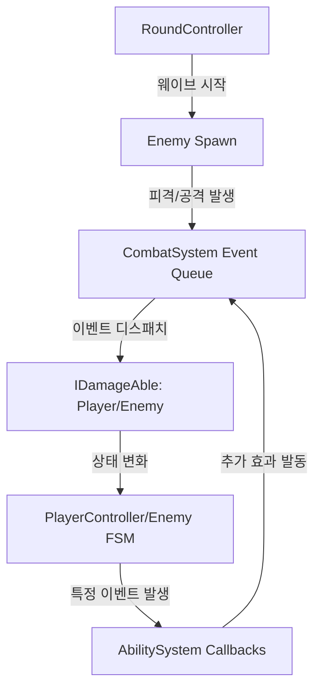

# [Project Technical Document] Project: Toga, 3D TPS Roguelike

## 1. 프로젝트 개요 (Project Overview & Why)
**Project Toga**는 긴박한 3D TPS 액션과 로그라이크의 전략적 성장 요소를 결합한 액션 게임입니다. 
- **목적**: 대규모 적 유입(Wave) 상황에서 플레이어의 조작 실력과 실시간 능력(Ability) 조합을 통해 생존하고 다음 스테이지로 나아가는 핵심 루프를 구현합니다.
- **배경(Why)**: 기존 TPS 게임의 경직된 성장 구조를 탈피하여, 매 판 다른 능력 조합(Ability System)을 통해 반복 플레이 가치를 창출하고, **이벤트 기반 아키텍처**를 통해 전투 로직의 확장성과 유지보수성을 확보하고자 설계되었습니다.

## 2. 전체 시스템 구조 (High-Level Architecture)

프로젝트는 중앙 집중식 매니저(Manager-Pattern이걸)와 이벤트 기반의 전투 시스템을 중심으로 설계되었습니다.

### 2.1 핵심 모듈 구성
- **Core Managers**: `GameManager`(게임 상태), `RoundController`(웨이브 로직), `AbilitySystem`(능력 관리)
- **Actor System**: `PlayerController`(FSM 기반 제어), `Enemy`(추상화된 적 AI)
- **Combat Logic**: `CombatSystem`(이벤트 큐 기반 전투 처리), `IDamageAble`(인터페이스 기반 데미지 체계)
- **Data Layer**: `ScriptableObject`를 활용한 라운드(`RoundObject`) 및 능력(`AbilityObject`) 데이터 정의

### 2.2 모듈 간 의존성 및 데이터 흐름


## 3. 핵심 기능 및 실행 흐름 (Core Features & Flow)

### 3.1 이벤트 큐 기반의 전투 시스템 (Combat Event System)
`CombatSystem`은 직접적인 참조 대신 `InGameEvent` 큐를 사용하여 데미지 계산을 비동기적으로 처리합니다. 이는 복잡한 능력(Ability) 효과가 중첩될 때 발생할 수 있는 의존성 스파게티를 방지합니다.

- **실행 절차**:
  1. 공격 주체가 `CombatEvent` 생성 후 `CombatSystem.AddEvent()` 호출.
  2. `CombatSystem`은 `Update` 루프에서 큐를 순회하며 적절한 `IDamageAble`에게 이벤트 전달.
  3. `LocalPlayer` 또는 `Enemy`는 각 부위별 콜라이더(Head, Body 등)에 따라 차등 데미지 계산.

### 3.2 동적 능력 시스템 (Dynamic Ability System)
플레이어는 최대 6개의 능력을 장착할 수 있으며, 각 능력은 `AbilitySystem.Callbacks`를 통해 특정 상황(사격, 대시, 장벽 생성 등)에 자동으로 트리거됩니다.

```csharp
// Ability.cs: 이벤트 구독을 통한 확장성 확보
protected virtual void Start() {
    AbilitySystem.Instance.Events.OnFireAbilityEvent += UseFireAbility;
    AbilitySystem.Instance.Events.OnDashAbilityEvent += UseDahsAbility;
    // ... 기타 이벤트 구독
}
```

## 4. 구조적 고민과 선택 (Architectural Trade-offs)

### 4.1 FSM(Finite State Machine) vs. Behavior Tree
- **선택**: `PlayerState` 및 `EnemyState`를 활용한 **FSM** 채택.
- **이유**: TPS 특성상 플레이어의 상태(Idle, Walk, Fire, Reload)가 명확하고 상호 배타적입니다. 상태가 추가될 때마다 클래스를 분리하여(`PlayerFireWalkState` 등) 단일 책임 원칙을 준수했으며, 이는 하드코딩된 조건문보다 디버깅과 확장에 용이합니다.

### 4.2 이벤트 큐 기반 전투 vs. 직접 함수 호출
- **선택**: **이벤트 큐(Queue)** 방식 채택.
- **이유**: 로그라이크 특성상 수많은 능력이 동시에 발동될 수 있습니다. 직접 호출 방식은 프레임당 계산 부하가 특정 시점에 몰릴 수 있으나, 큐 방식을 통해 실행 시점을 제어하고 사후 처리를 중앙화할 수 있었습니다.

### 4.3 오브젝트 풀링(Object Pooling)
- **선택**: `RoundController` 내의 `Queue<Enemy>`를 통한 풀링 구현.
- **이유**: 다수의 적이 생성되고 소멸하는 로그라이크 환경에서 `Instantiate/Destroy`로 인한 가비지 컬렉션(GC) 스파이크를 최소화하기 위해 필수적인 선택이었습니다.

## 5. 종합 결과 및 회고 (Project Post-mortem & Next Steps)

### 5.1 성과
- **코드 재사용성**: `IDamageAble` 인터페이스와 `Enemy` 추상 클래스를 통해 새로운 타입의 적을 추가할 때 기존 전투 로직을 수정할 필요가 없는 구조를 확립했습니다.
- **성능 최적화**: 부위별 히트박스 판정(`Parts`)과 오브젝트 풀링을 통해 대규모 웨이브 상황에서도 안정적인 프레임을 유지했습니다.

### 5.2 기술 부채 및 한계
- **FSM 클래스 폭발**: 상태가 세분화됨에 따라(`FireIdle`, `FireWalk` 등) 클래스 개수가 급격히 증가했습니다. 향후 상태 간 공통 로직을 처리할 서브 상태 머신(Sub-FSM) 도입이 필요합니다.
- **중앙 집중식 매니저**: `GameManager`와 `AbilitySystem`이 싱글톤으로 구현되어 있어 시스템 간 결합도가 여전히 존재합니다. 향후 **의존성 주입(DI)** 패턴 도입을 고려할 수 있습니다.

### 5.3 향후 발전 계획 (Next Steps)
1. **능력 조합(Synergy) 시스템**: 현재 단독 발동되는 능력을 넘어, 특정 능력들이 모였을 때 새로운 효과를 내는 시너지 로직 추가.
2. **데이터 테이블 외부화**: `ScriptableObject` 데이터를 JSON 또는 Excel과 연동하여 기획자가 코드 수정 없이 밸런스를 조절할 수 있는 파이프라인 구축.
3. **네트워크 멀티플레이 확장**: 현재의 이벤트 기반 구조를 패킷 직렬화 구조로 변환하여 협동 모드 기반 마련.
